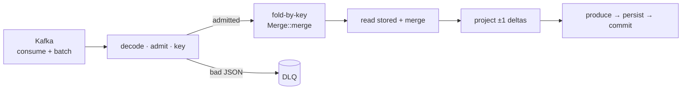

<h1 align="center">stitcher</h1>

<p align="center">
  <strong>Config-driven Kafka stream-aggregation framework.</strong><br/>
  Fold heterogeneous events into durable, mergeable session state and emit change-deltas downstream — no code per use case.
</p>

<hr/>

## What it is

**stitcher** folds a Kafka stream of differently-shaped events into one durable record per key — a *session* — and emits a change-delta each time that record updates. It's **CQRS over a stream**: every event is a fact folded into a per-key aggregate (the write model), and a projection derives downstream rows from it (the read model).

The example (`config/intent.yaml`) sessionizes a payment — intent, attempts, refunds, API and connector logs, all **different schemas on one topic** — into one record keyed by `payment_id-merchant_id`. The binary needs **no domain code**: a run is `config/<RUN_ENV>.toml` + a state schema + an output map.

## Quickstart

```sh
cargo run -p stitcher-cli -- --inspect   # dry tap: consume + decode + merge + print
cargo run -p stitcher-cli                # real run: build state, produce, persist, commit
```

Needs Kafka + Cassandra. Create the state table first:

```sql
CREATE TABLE IF NOT EXISTS stitcher.state (
  id text, id_type text, version bigint, state blob,
  PRIMARY KEY ((id_type), id));
```

**Ops endpoints** (`:9090`): `GET /health` · `GET /metrics` (Prometheus) · `GET /state?id_type=<>&id=<>`
— look up a session's stored state, reusing the pipeline's store connection (`200` state ·
`404` absent · `400` bad param). PII redaction is on by default; `/state` returns raw session
data, so keep the ops port cluster-internal.

## How it works

**Ordering invariant: produce → persist → commit** (at-least-once; safe on replay because
every merge is a commutative monoid).



Full stage → function map: [`docs/DATA_FLOW.md`](docs/DATA_FLOW.md).

## The schema

A YAML schema compiles into a `Program` the interpreter runs. It declares **admission**
(what counts as state), **keying**, and **fields** (how state is built):

```yaml
primary_key: "{payment_id|log.payment_id}-{merchant_id|log.merchant_id}"
decode_filter:
  log_type_path: "log_type|api_flow|flow"   # discriminator: first path present wins
fields:
  payment_intent:                            # body under `log`
    node: latest_by
    when: "log_type == 'payment_intent'"
    comparator: "parse_time(log.modified_at)"
    payload: "log"
  api_event_object:                          # different domain, FLAT — payload defaults to `$`
    node: keyed_map
    when: "api_flow == 'PaymentsCreate'"
    key: "meaningful(created_at_timestamp)"
  log_count: { node: counter }
```

The `a|b|c` **alternation** is the join mechanism — *"tell it where to find the value"* — so
differently-shaped events co-key into the same session.

**Merge nodes:** `latest_by` (greatest comparator) · `keyed_map` (grow-only map of `latest_by`) · `last` · `once` (write-once) · `counter`.
**DSL** (in `when`/`key`/`comparator`/`payload`): paths + `== != < <= > >= && || !` and builtins `parse_time, meaningful, bucket, round, trim, lower, coalesce, latest, first, list, get, lookup`.

## Storage

A `ComposedStore` fronts **Scylla/Cassandra** (authoritative) with a partition-local **RocksDB** read-through cache. State is JSON; a version mismatch on read is treated as absent (schema-evolution seam via `Processor::upcast`).

## Workspace

| crate | role |
|---|---|
| `crates/dsl` | schema model + expression language (pest → `Expr` AST) |
| `crates/stitcher` | the framework: traits, pipeline, state interpreter, Kafka + RocksDB + Scylla |
| `crates/transformer` | config-driven output projection (`transformer.toml` → N topics) |
| `crates/stitcher-cli` | the `stitcher` binary |

## Build

```sh
# deps: brew install cmake pkg-config   (macOS)
#       apt-get install cmake clang libsasl2-dev libssl-dev pkg-config   (Debian)
cargo build --workspace
cargo clippy --workspace --all-targets -- -D warnings
```

## License

Apache-2.0.
