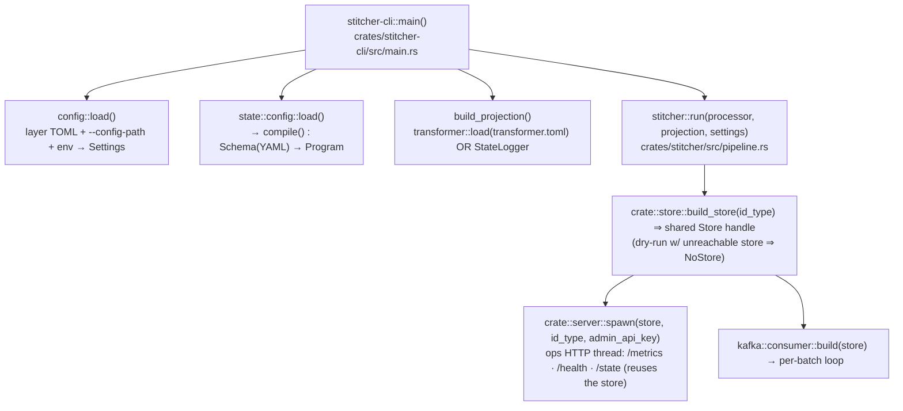
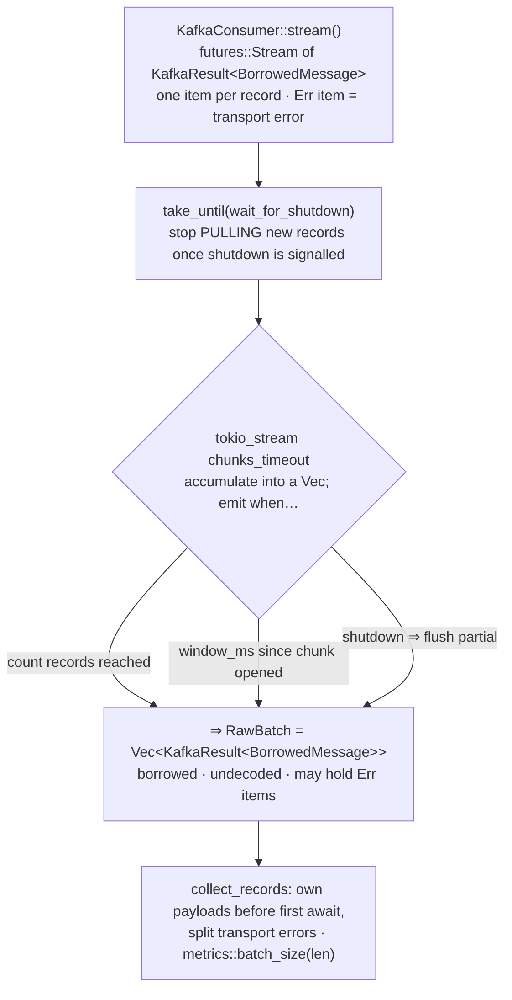
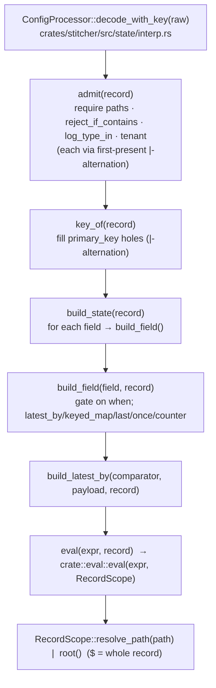
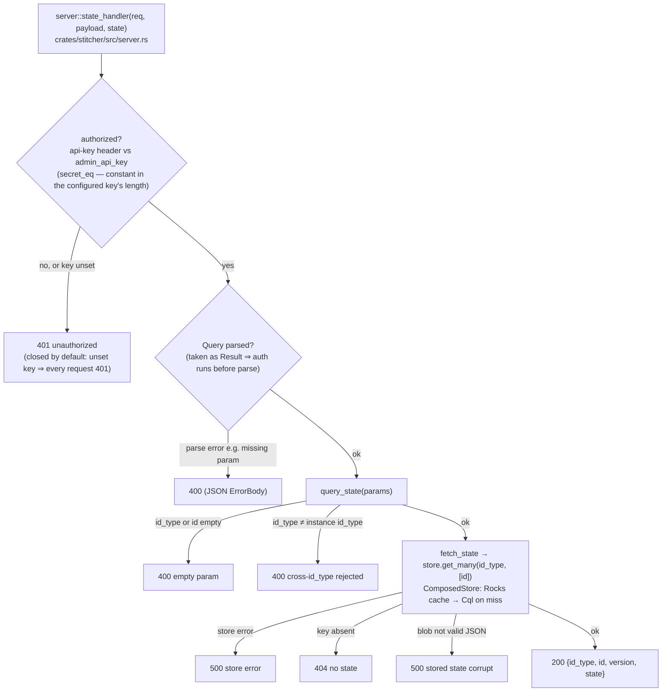

# Data flow — what runs at each stage

How one Kafka batch is processed, and the exact function invoked at every step. Paths are
relative to the repo root. (Rendered diagrams below use Mermaid — GitHub renders them
inline.) The bulk is the **write path** (one Kafka batch); the ops **read path**
(`GET /state`) — a point lookup of the same folded state — is covered at the end.

## Boot



`run` builds **one** shared `Store` handle and hands a clone to both the ops HTTP server
and the consumer, so a single connection pool (one Scylla session, one Rocks handle) backs
the fold pipeline and `/state` (see the read path below).

`compile()` turns the schema into a `Program`: the key template (`KeySeg`), the admission
`FilterProg` (with `|`-alternation split), and the compiled `FieldProg` fields (each a
`latest_by` / `keyed_map` / `last` / `once` / `counter` node with pre-parsed `Expr`s).

## Per-batch pipeline

```mermaid
flowchart TD
  subgraph RUN["pipeline::run — loop"]
    C["KafkaConsumer::stream() → chunks_timeout<br/>(count / window_ms) ⇒ RawBatch"]
    C --> PB["process_batch(proc, store, ctx, batch)"]
    PB --> CM["consumer.commit(watermarks)<br/>offsets committed LAST"]
  end

  subgraph PB2["process_batch — per record"]
    D["proc.decode_with_key(payload)"]
    D -->|None + valid JSON| FIL["dropped by design (filtered)"]
    D -->|None + bad JSON| DLQ["classify_and_route → producer.send_dlq()"]
    D -->|Some (key,state)| FOLD["fold by key:<br/>old.merge(state)  (Merge::merge)"]
  end

  subgraph PB3["process_batch — per key"]
    GM["store.get_many(id_type, keys)<br/>ComposedStore: Rocks → Cql"]
    GM --> DS["proc.decode_stored(blob)  (version == state_version)<br/>else proc.upcast(version, blob)"]
    DS -->|had stored| MIN["ctx.projection.project(old, Sign::Minus)"]
    MIN --> MG["old.merge(local)  (Merge::merge)"]
    DS -->|first time| MG
    MG --> PLUS["ctx.projection.project(merged, Sign::Plus)"]
    PLUS --> SEND["ctx.producer.send_all(msgs)  → sink topics"]
    SEND --> PUT["store.put(id_type, key, version, blob, part)<br/>ComposedStore: Rocks + Cql (try_join)"]
  end

  PB --> D
  FOLD --> GM
```

**Ordering invariant:** `send_all` (produce) → `store.put` (persist) → `consumer.commit`
(offsets). At-least-once; safe on replay because every merge is a commutative monoid.

## Consume → micro-batch (what node `C` expands to)

`C` compresses the whole source stage: the raw record stream, the shutdown cutoff, the
dual-trigger batching, and the `RawBatch` type. Expanded (`spawn_source`,
`crates/stitcher/src/pipeline.rs:148`):



- **`chunks_timeout` is a dual-trigger micro-batch.** It flushes a chunk when *either*
  `batch.count` records accumulate *or* `batch.window_ms` ms pass since the chunk opened —
  whichever fires first — so a low-traffic partition still drains on the timer. `count` /
  `window_ms` are the `--aggregation-batch-count` / `--aggregation-window-ms` settings
  (`crate::config::Batch`; default `window_ms = 1`).
- **"Raw" = borrowed + undecoded.** Items are `BorrowedMessage`s tied to the consumer, and a
  transport failure rides along as an `Err` item rather than aborting the stream — so finished
  work still commits. `collect_records` owns each payload before the first `.await`
  (`BorrowedMessage` can't cross one) and peels off the transport error; decode/admit happens
  later, inside `process_batch`.
- **Shutdown drains in place.** `take_until(wait_for_shutdown)` only stops *pulling* new
  records; `chunks_timeout` still emits the final partial batch, which is processed and
  committed before the loop ends.

## `decode_with_key` — the config-driven state build



## Read path — `GET /state?id_type=<>&id=<>`

A point lookup of one session's **already-folded** state over the ops HTTP server. It reads
the *same* `ComposedStore` blob the write path persists — it is a read side, not a separate
read model/projection, so there is no second store to keep in sync.



Every response — success **and** error — is sent `Cache-Control: no-store`: `/state` returns
raw session data (PII), so no intermediary or client cache may retain it. Keep the ops port
cluster-internal.

**Why the cross-`id_type` reject.** The `id_type` handed to `server::spawn` is
`proc.id_type()` — the single type this process folds. `RocksStore` is single-id_type per
process and `get_many` ignores its `id_type` argument for the local cache, so a query for any
other type could return a wrong-type cache hit; `query_state` rejects it (400) rather than
serve it. This is a data-flow guard, not authorization.

**Read vs write divergences** — a read is *not* a replay of the fold path:

- **Eventually consistent.** Persist precedes commit (the ordering invariant above), so
  `/state` may return folded state for records whose offsets are not yet committed; it
  reflects the last successfully persisted merge, not a committed-offset snapshot. A Rocks
  cache hit returns this process's last write; the authoritative remote is read only on a miss.
- **No version upcast.** The fold path upcasts or drops a blob whose `version != state_version`
  (`decode_stored` / `upcast`); `/state` returns the raw stored `version` and decodes the blob
  as JSON unconditionally — it can hand back a pre-upcast blob the pipeline would have migrated.
- **Corrupt blob.** The fold path treats an undecodable stored blob as *absent* and continues;
  `/state` surfaces it as `500 stored state corrupt`.
- **Dry-run.** Inspect dry-run with an unreachable store runs on `NoStore`; `/state` then
  always returns 404.

## Stage → function map

| stage | function | file |
|---|---|---|
| consume + batch | `KafkaConsumer::stream` + `chunks_timeout` | `crates/stitcher/src/kafka/consumer.rs` |
| decode + admit + key | `ConfigProcessor::decode_with_key` → `admit` → `key_of` | `crates/stitcher/src/state/interp.rs` |
| build contribution | `build_state` → `build_field` → `build_latest_by` | `crates/stitcher/src/state/interp.rs` |
| evaluate DSL | `eval` → `crate::eval::eval` + `RecordScope` (`resolve_path`, `root`) | `crates/stitcher/src/eval.rs`, `state/interp.rs` |
| fold within batch | `Merge::merge` (`MergeValue`) | `crates/stitcher/src/merge.rs` |
| read stored state | `Store::get_many` (`ComposedStore` → `RocksStore`, `CqlStore`) | `crates/stitcher/src/store/{mod,rocks,cql}.rs` |
| decode stored / migrate | `Processor::decode_stored` / `Processor::upcast` | `state/interp.rs`, `processor.rs` |
| project deltas | `Projection::project(state, Sign, ctx)` (`Transform` or `StateLogger`) | `crates/transformer/src/engine.rs` |
| produce | `KafkaProducer::send_all` / `send_dlq` | `crates/stitcher/src/kafka/producer.rs` |
| persist | `Store::put` (`ComposedStore` → Rocks + Cql via `try_join`) | `crates/stitcher/src/store/mod.rs` |
| commit | `KafkaConsumer::commit` | `crates/stitcher/src/kafka/consumer.rs` |
| malformed → DLQ | `classify_and_route` → `KafkaProducer::send_dlq` | `crates/stitcher/src/pipeline.rs` |
| ops server spawn | `server::spawn` (shares the pipeline's `Arc<dyn Store>`) | `crates/stitcher/src/server.rs` |
| read: authenticate | `state_handler` → `authorized` → `secret_eq` (constant in the configured key's length) | `crates/stitcher/src/server.rs` |
| read: validate | `query_state` (reject empty `id_type`/`id`; reject `id_type` ≠ instance's) | `crates/stitcher/src/server.rs` |
| read: fetch state | `fetch_state` → `Store::get_many` (see *read stored state* row) → `serde_json::from_slice` | `crates/stitcher/src/server.rs` |

## Worked example (the six demo events)

For `pay_DEMO001` (see the README), each record flows `decode_with_key → admit → key_of`
to the same key `pay_DEMO001-mer_DEMO`, then `build_field` routes it by its `when`:

- `log_type=='payment_intent'` (×2) → `payment_intent` `latest_by`; the second (later
  `modified_at`) wins under `Merge::merge`.
- `log_type=='payment_attempt'` → `payment_attempt_object` `keyed_map[att_A]`.
- `log_type=='refund'` → `refund_object` `keyed_map[ref_A]`.
- `api_flow=='PaymentsCreate'` (flat) → `api_event_object`; `payload` omitted ⇒ `Expr::Root`
  ⇒ `RecordScope::root()` stores the whole event.
- `flow=='Authorize'` (flat) → `connector_event_object`, same `$` default.
- every record → `log_count` `counter` (+1 ⇒ 6).

All six merge into one `MergeValue::Map`, `store.put` writes it to RocksDB + Cassandra, and
offsets commit.
